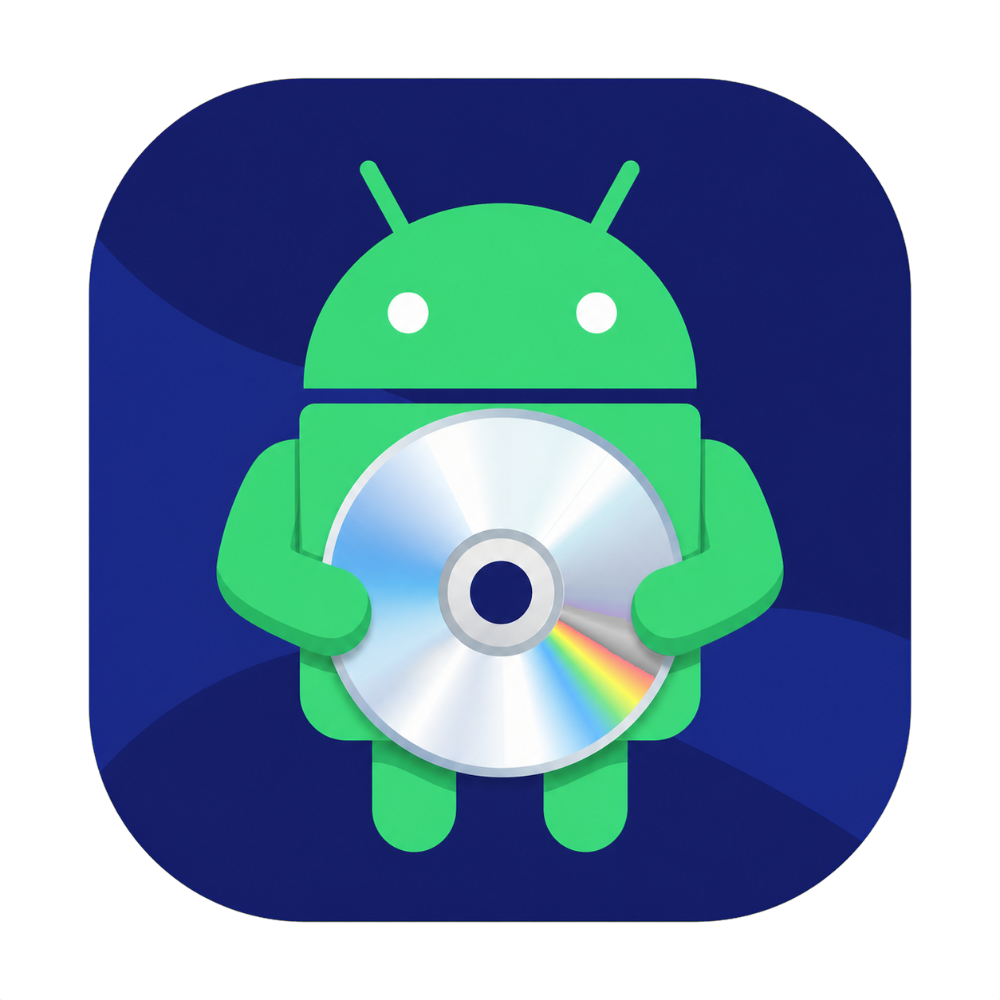
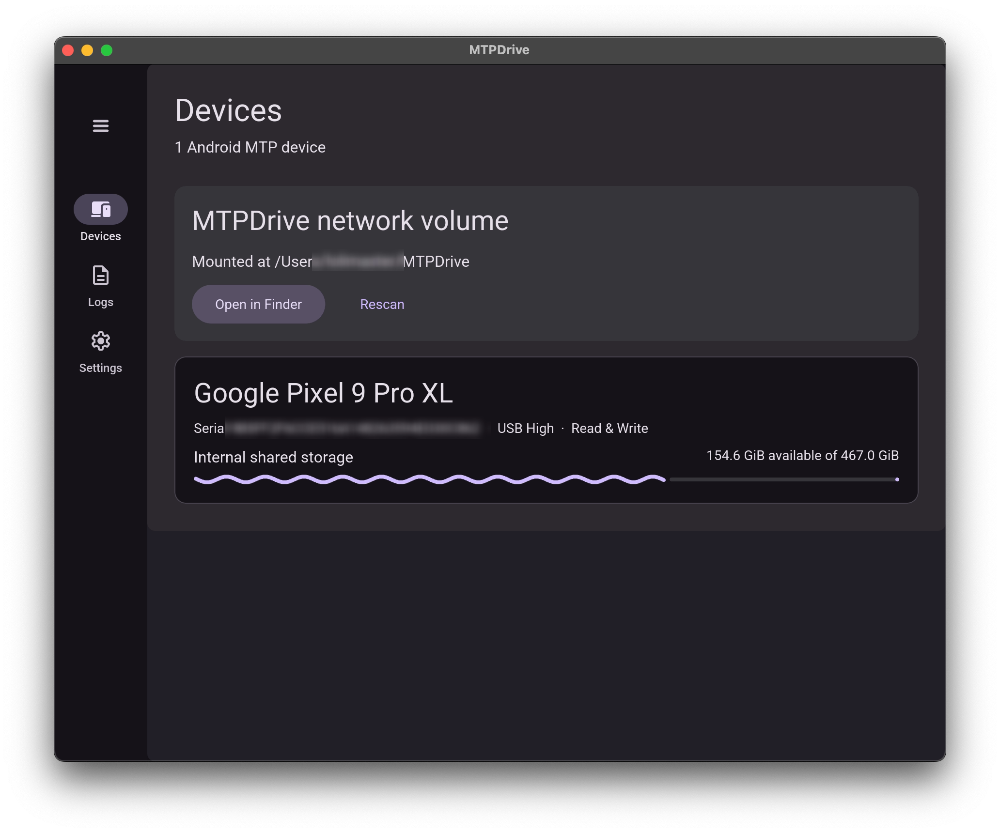
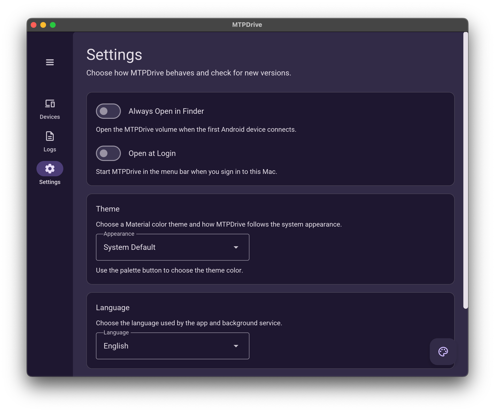

<p align="center">
  
</p>

<h1 align="center">MTPDrive</h1>

<p align="center">
  <strong>Your Android phone, right where it belongs: Finder.</strong>
</p>

<p align="center">
  <a href="https://github.com/moeleak/mtpdrive/releases/latest"></a>
  <a href="https://github.com/moeleak/mtpdrive/actions/workflows/ci.yml"></a>
  
  
  <a href="LICENSE"></a>
</p>

<p align="center">
  <a href="https://github.com/moeleak/mtpdrive/releases/latest"><strong>Download the latest Universal DMG</strong></a>
  ·
  <a href="#build-from-source">Build from source</a>
</p>

<p align="center">
  
</p>

MTPDrive turns an Android phone connected over USB into a Finder-accessible
network volume. It speaks MTP to the phone and serves the files through the NFS
client already built into macOS—so there is no FUSE installation, kernel
extension, or `libmtp` dependency.

Everything in the file path stays local: Android MTP over USB on one side,
loopback NFS on the other.

## Why MTPDrive?

| | |
| --- | --- |
| 🗂️ **Feels at home in Finder** | Browse, copy, upload, rename, and delete through a volume named **MTPDrive**, rather than a mysterious `127.0.0.1` server. |
| 🚫 **No third-party filesystem driver** | Uses the NFSv3 client included with macOS. No FUSE, kext, or system extension is required. |
| ⚡ **Built for large Android folders** | Directory metadata is cached, refreshed from MTP object events, and revalidated in the background instead of making Finder wait on one USB request per file. |
| 📱 **Multiple devices and storage areas** | Connected phones appear as top-level folders, with their internal or removable storage beneath them. |
| 🎛️ **A real menu-bar app** | See devices and capacity, open the volume, rescan USB, inspect structured logs, and change settings without living in Terminal. |
| 🌗 **Looks right on your Mac** | Material themes, custom colors, and System/Light/Dark appearance modes are powered by [`material-ui-rs`](https://github.com/moeleak/material-ui-rs). |
| 🌏 **English and Simplified Chinese** | The app, service messages, logs, and CLI follow the selected app or system language. |
| 🔄 **Updates without hunting for files** | Check for a release in Settings; MTPDrive downloads the new DMG to Downloads, verifies it, and opens it. |

## Everything you need, one menu-bar click away

<p align="center">
  
</p>

<p align="center">
  <sub>Open at Login, adaptive appearance, Material colors, language, and updates.</sub>
</p>

## Install in a minute

1. Download the [latest Universal DMG](https://github.com/moeleak/mtpdrive/releases/latest).
2. Open it and drag **MTPDrive** into **Applications**.
3. Launch MTPDrive. Its Android-and-disc icon will appear in the menu bar.
4. Connect an unlocked Android phone over USB and select **File transfer / MTP**
   (sometimes shown as **File transfer / Android Auto**) on the phone.
5. Choose **Open in Finder**. The volume is mounted at `~/MTPDrive` and appears
   in Finder as **MTPDrive**.

Current community builds are ad-hoc signed rather than notarized. If Gatekeeper
blocks the first launch, Control-click **MTPDrive.app**, choose **Open**, and
confirm once. You do not need to disable Gatekeeper.

To keep MTPDrive available after every sign-in, enable **Settings → Open at
Login**. macOS remains the source of truth for the login item and may ask for
approval in **System Settings → General → Login Items**.

## Requirements

- macOS 13 Ventura or newer
- Apple Silicon or Intel Mac
- Android device exposing standard MTP; Android 5.0 or newer is the intended
  compatibility range
- A USB cable that supports data, not charging only

MTP allows only one desktop process to own a device session. MTPDrive stops the
current user's Image Capture daemon (`icdd`) when it is holding the phone and
immediately attempts the USB claim. If Preview, Photos, Android File Transfer,
or another app is actively using the device, close that app and choose
**Rescan**.

## How it works


The background service owns the MTP sessions, translates Finder operations,
and exposes a local NFSv3 filesystem. The menu-bar app and CLI communicate with
that service through a typed local control socket.

Finder is much more metadata-hungry than MTP. MTPDrive therefore:

- returns cached directory metadata immediately when possible;
- merges MTP object-added, changed, and removed events into cached folders;
- revalidates folders in the background after a short freshness window;
- periodically performs a full scan as a fallback for missed device events;
- gives foreground reads, writes, and deletes priority over background scans;
- stages Finder's random writes before committing a complete object to MTP.

This keeps repeat visits to large camera or media folders responsive without
hiding files newly created on the phone.

## Menu-bar app

The native Rust UI has three pages:

- **Devices** — mount status, connected phones, USB speed, write capability,
  storage capacity, Finder shortcut, and rescan action.
- **Logs** — the built-in `material-ui-rs` Log Viewer for searchable,
  structured service logs.
- **Settings** — Finder behavior, Open at Login, Material color theme,
  System/Light/Dark appearance, language, and update downloads.

Closing the window hides it. Clicking the menu-bar icon returns to the same
single window without opening duplicate app instances.

## Command-line companion

The DMG includes the `mtpdrive` helper inside the app bundle. Source builds also
produce it as `target/debug/mtpdrive` or `target/release/mtpdrive`.

```sh
MTPDRIVE=/Applications/MTPDrive.app/Contents/Helpers/mtpdrive

"$MTPDRIVE" status
"$MTPDRIVE" devices
"$MTPDRIVE" open
"$MTPDRIVE" refresh
"$MTPDRIVE" logs --follow
```

Add `--json` to `status` or `devices`, and `--json` to `logs` for JSON Lines
output. Set `MTPDRIVE_LANG=en` or `MTPDRIVE_LANG=zh-Hans` to override language
detection for a command.

## Troubleshooting

### The phone does not appear

Unlock it, reconnect USB, select **File transfer / MTP**, close other apps that
may own the phone, and choose **Rescan**. A charge-only cable will not expose an
MTP interface.

### Finder shows a disconnected volume

Open MTPDrive from the menu bar and choose **Rescan**. The service detects and
replaces stale mounts left by an earlier process while avoiding volumes it did
not create.

### The first visit to a large folder takes longer

The initial visit must enumerate that folder over MTP. Later visits use cached
metadata while freshness validation runs in the background.

### I need diagnostic details

Open the **Logs** page, or run:

```sh
/Applications/MTPDrive.app/Contents/Helpers/mtpdrive logs --follow
```

Logs and settings are stored below `~/Library/Application Support/MTPDrive`.

## Build from source

The reproducible development environment follows the project's `flake.nix`:

```sh
git clone https://github.com/moeleak/mtpdrive.git
cd mtpdrive
nix develop
cargo test --workspace
cargo xtask dmg
```

The last command builds and ad-hoc signs a Universal `arm64` + `x86_64` app and
writes `dist/MTPDrive-<version>-universal.dmg` with a SHA-256 checksum.

Useful development commands:

```sh
cargo run -p mtpdrive-cli -- devices
cargo run -p mtpdrive-cli -- daemon --no-mount
cargo run -p mtpdrive-app
```

The workspace is split by responsibility:

- `mtpdrive-core` — MTP sessions, caching, staging, NFS backend, IPC, settings,
  localization, and domain models;
- `mtpdrive-app` — native Material UI, tray integration, updater, themes, and
  macOS login item support;
- `mtpdrive-cli` — command parsing, service dispatch, and text/JSON output;
- `xtask` — Universal app and DMG packaging.

## Releases and contributing

Tags such as `v0.1.2` trigger native Apple Silicon and Intel builds on GitHub
Actions. The release workflow merges them into a Universal app, verifies its
signature and DMG, generates release notes from Conventional Commits, and
publishes the DMG plus checksum automatically.

Bug reports and focused pull requests are welcome in
[GitHub Issues](https://github.com/moeleak/mtpdrive/issues). For changes, run
`cargo fmt --all -- --check` and `cargo test --workspace` before opening a PR.

## License and artwork

MTPDrive is available under the [MIT License](LICENSE).

The Android robot artwork is adapted from work created and shared by Google
and is used under the Creative Commons Attribution 3.0 License. Android is a
trademark of Google LLC. MTPDrive is an independent project and is not
affiliated with or endorsed by Google LLC. See
[THIRD_PARTY_NOTICES.md](THIRD_PARTY_NOTICES.md).
